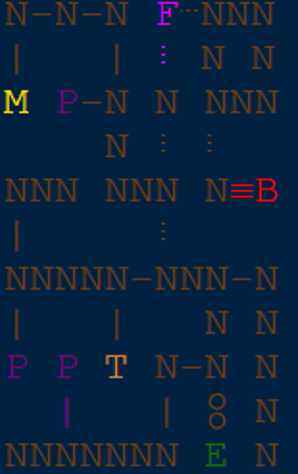
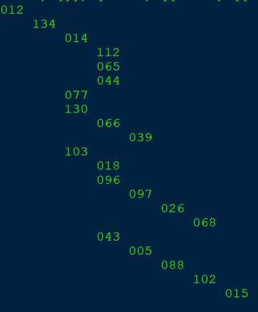

# Dungeon Map Parser/Visualizer
Parses a given Hypixel Skyblock dungeon map in UnclaimedBloom6's standard map format


Converts a map string into a tree for a statistical analysis project and provides a CLI rendering of the map as a tree


# Installation and Running 

```bash
python -m venv venv 
. venv/bin/activate
pip install -r requirements.txt
python mapParser.py
```
